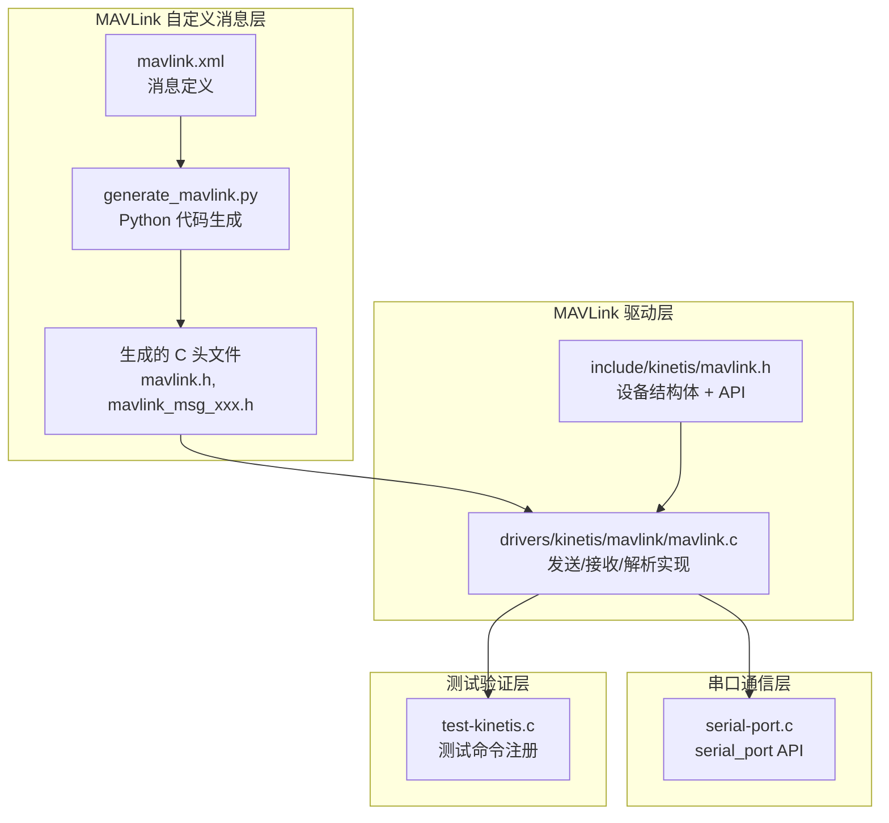

## 产品概述

基于 MAVLink 自定义消息集，实现主机通过串口控制从机电机转速和方向的主从模拟仿真系统。代码使用 Python 脚本生成 MAVLink C 头文件，驱动层使用项目现有的 `serial-port.c` 串口框架，仿照 `t_msz_send_random_file` 模式实现主从双端互连仿真测试。

## 核心功能

- **MAVLink 自定义消息定义**：定义电机控制（MOTOR_CONTROL）、电机状态反馈（MOTOR_STATUS）、指令确认（MOTOR_ACK）三条自定义消息
- **Python 代码生成**：使用 pymavlink 工具从 XML 定义自动生成 C 头文件
- **MAVLink 驱动封装**：基于 serial-port 接口封装 MAVLink 消息的打包/发送/接收/解析
- **主从模拟仿真**：创建 master/slave 两个 serial_port 实例互连，主机发送控制指令，从机接收并响应状态反馈，验证通信正确性
- **电机控制仿真**：支持多电机（最多4个）的转速（RPM）、方向（正转/反转/停止）控制，从机模拟电机惯性响应

## 技术栈

- **MAVLink 协议**：使用 MAVLink v2 自定义 dialect，消息ID从 50000 起
- **代码生成工具**：Python + pymavlink（mavgen），从 XML 生成 C 头文件
- **通信接口**：复用项目现有 `serial-port.c` 框架（`serial_port_alloc/transmit_bytes/receive_bytes`）
- **主从互连**：复用 `SERIAL_PORT_DF_OTHERS` 线程模式（`serial_port_copy_to_others`）
- **项目编码规范**：遵循 Kinetis 项目编码风格（小写+下划线、regmap 模式、Doxygen 注释、u8/u16/u32 类型）

## 实现方案

### 整体策略

1. 在 `include/kinetis/mavlink/mavlink.xml` 中定义自定义 MAVLink dialect
2. 编写 Python 脚本调用 pymavlink 的 mavgen 生成 C 头文件到 `include/kinetis/mavlink/` 目录
3. 在 `include/kinetis/mavlink.h` 中定义 MAVLink 设备结构和公开 API
4. 在 `drivers/kinetis/mavlink/mavlink.c` 中实现 MAVLink 收发逻辑和测试函数
5. 在 `drivers/kinetis/test-kinetis.c` 中注册测试命令

### 关键技术决策

**1. MAVLink 消息设计（3条自定义消息）**

- `MOTOR_CONTROL (50000)`：主机→从机，含 target_id/speed/direction
- `MOTOR_STATUS (50001)`：从机→主机，含 motor_id/current_speed/direction/status
- `MOTOR_ACK (50002)`：从机→主机，含 motor_id/ack_result
- 消息ID使用 50000+ 范围，与 MAVLink 标准消息不冲突

**2. MAVLink v2 选择**

- 支持更长的消息（>255字节扩展）、签名可选、向后兼容 v1
- 本项目消息较短，但选 v2 为未来扩展预留空间

**3. 主从仿真架构（复用 t_msz_send_random_file 模式）**

```
serial_master ←(copy_to_others)→ serial_slave
主机线程:                           从机线程:
  发送 MOTOR_CONTROL                接收 MOTOR_CONTROL
  接收 MOTOR_STATUS/ACK             模拟电机响应
                                    发送 MOTOR_STATUS/ACK
```

- 两个 serial_port 通过 `SERIAL_PORT_DF_OTHERS` 线程互连
- 从机在独立 pthread 中运行消息处理循环

**4. 电机仿真模型**

- 惯性模型：current_speed 逐步趋近 target_speed
- 方向切换：需先减速到0再反转
- 状态码：STOPPED=0, RUNNING=1, FAULT=2
- 随机故障注入（低概率模拟，增加测试鲁棒性）

**5. SERIAL_PORT_BUFFER_SIZE=256 限制**

- MAVLink v2 最小帧约 12 字节，MOTOR_CONTROL 消息帧约 20 字节，完全适配
- 无需修改串口缓冲区大小

### 性能与可靠性

- **消息延迟**：serial_port_copy_to_others 线程 1ms 轮询，MAVLink 仿真控制指令在 2ms 内送达
- **吞吐量**：单条消息约 20 字节，远低于串口缓冲区 256 字节上限
- **错误处理**：MAVLink 自带 CRC 校验，消息解析失败时丢弃并计数
- **线程安全**：每个 serial_port 实例独立，copy_to_others 线程自带同步

## 实现注意事项

- **Makefile 修改**：需添加 `C_SOURCES += $(wildcard ../drivers/kinetis/mavlink/*.c)` 否则 mavlink.c 不参与编译
- **pymavlink 安装**：需要 `pip install pymavlink`，生成脚本在项目中保留
- **生成代码不可手改**：mavlink 生成的头文件由 Python 脚本管理，修改需改 XML 后重新生成
- **serial_port 互连模式**：必须双向启动（sz→rz 和 rz→sz），参考 msz.c 第 197-198 行
- **SERIAL_PORT_BUFFER_SIZE=256**：MAVLink 消息帧均在此范围内，无需调整

## 架构设计

### 系统架构图



### 数据流

```
主机: mavlink_send_motor_control() → MAVLink打包 → serial_port_transmit_bytes()
                                                    ↓ (copy_to_others线程)
从机: serial_port_receive_bytes() → MAVLink解析 → mavlink_handle_motor_control()
                                                    ↓
     mavlink_send_motor_status() ← 电机仿真模型 ← 应用控制指令
```

## 目录结构

### 新建/修改文件清单

```
E:\Code\Kinetis\
├── include/kinetis/
│   ├── mavlink.h                    # [MODIFY] MAVLink 驱动头文件。定义 mavlink_device 结构体（含 serial_port 指针、系统ID、组件ID、消息统计）、mavlink_motor_state 结构体（电机仿真状态）、公开 API 声明（mavlink_init/send_motor_control/send_motor_status/send_motor_ack/receive_and_process）。遵循项目编码规范。
│   └── mavlink/
│       ├── mavlink.xml              # [MODIFY] MAVLink 自定义 dialect XML 定义。定义 kinetis dialect，包含 3 条消息：MOTOR_CONTROL(50000) 含 target_id/speed/direction，MOTOR_STATUS(50001) 含 motor_id/current_speed/direction/status，MOTOR_ACK(50002) 含 motor_id/ack_result。需符合 MAVLink XML schema。
│       └── (生成的头文件目录)        # [NEW] 由 pymavlink 自动生成，包含 mavlink.h、mavlink_msg_motor_control.h、mavlink_msg_motor_status.h、mavlink_msg_motor_ack.h 等
├── drivers/kinetis/
│   ├── mavlink/
│   │   └── mavlink.c               # [MODIFY] MAVLink 驱动实现。包含：1) MAVLink 消息打包/发送函数（基于 serial_port_transmit_bytes）；2) MAVLink 消息接收/解析函数（基于 serial_port_receive_bytes + mavlink_parse_char）；3) 从机消息处理循环线程（解析 MOTOR_CONTROL，驱动电机仿真模型，发送 MOTOR_STATUS/ACK）；4) 电机仿真模型（惯性响应、方向切换、状态管理）；5) 测试函数 t_mavlink_master_slave_sim（创建双 serial_port 互连，主机发送多组控制指令，验证从机响应正确性）
│   └── test-kinetis.c              # [MODIFY] 添加 MAVLINK 测试函数声明和命令注册。在 #ifdef DESIGN_VERIFICATION_MAVLINK 块中添加 t_mavlink_master_slave_sim 声明，在 kinetis_case_table 中注册 "mavlink.master-slave-sim" 命令
├── scripts/
│   ├── Makefile                     # [MODIFY] 添加 C_SOURCES += $(wildcard ../drivers/kinetis/mavlink/*.c)
│   └── generate_mavlink.py          # [NEW] Python 脚本，调用 pymavlink.mavgen 从 mavlink.xml 生成 C 头文件到 include/kinetis/mavlink/ 目录。脚本应检查 pymavlink 是否已安装，输出文件列表。
└── scripts/Kinetis_Plan.testlist    # [MODIFY] 添加 mavlink.master-slave-sim 测试条目
```

## 关键代码结构

### mavlink_device 结构体

```c
#define MAVLINK_MOTOR_COUNT    4
#define MAV_DIRECTION_STOP      0
#define MAV_DIRECTION_FORWARD   1
#define MAV_DIRECTION_REVERSE  -1
#define MAV_MOTOR_STOPPED       0
#define MAV_MOTOR_RUNNING       1
#define MAV_MOTOR_FAULT         2

struct mavlink_motor_state {
    u8 motor_id;
    s32 target_speed;       /* RPM */
    s32 current_speed;      /* RPM */
    s8 direction;           /* 0=stop, 1=fwd, -1=rev */
    u8 status;              /* 0=stopped, 1=running, 2=fault */
};

struct mavlink_device {
    struct serial_port *serial;
    u8 sysid;
    u8 compid;
    u8 target_sysid;
    u8 target_compid;
    struct mavlink_motor_state motors[MAVLINK_MOTOR_COUNT];
    /* Message statistics */
    u32 tx_count;
    u32 rx_count;
    u32 rx_errors;
    /* Thread control */
    u8 thread_running;
    pthread_t rx_thread;
    mavlink_status_t mav_status;
    mavlink_message_t rx_msg;
};
```

### 公开 API 签名

```c
struct mavlink_device *mavlink_init(struct serial_port *serial, u8 sysid, u8 compid);
void mavlink_free(struct mavlink_device *dev);
int mavlink_send_motor_control(struct mavlink_device *dev, u8 target_id, s32 speed, s8 direction);
int mavlink_send_motor_status(struct mavlink_device *dev, u8 motor_id, s32 current_speed, s8 direction, u8 status);
int mavlink_send_motor_ack(struct mavlink_device *dev, u8 motor_id, u8 ack_result);
int mavlink_receive_and_process(struct mavlink_device *dev, u32 timeout_ms);
int mavlink_start_rx_thread(struct mavlink_device *dev);
void mavlink_stop_rx_thread(struct mavlink_device *dev);
```

## Agent Extensions

### SubAgent

- **code-explorer**
- Purpose: 搜索 MAVLink C 生成代码的依赖关系和头文件包含模式，确保 mavlink.c 正确引用生成的头文件
- Expected outcome: 确认生成头文件的路径和 include 方式，避免编译错误